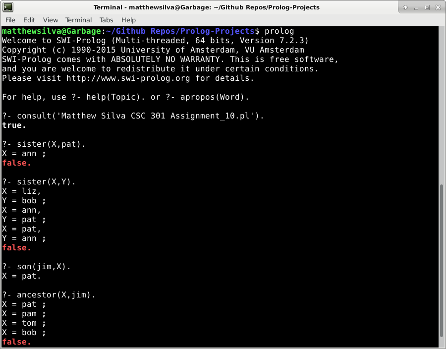
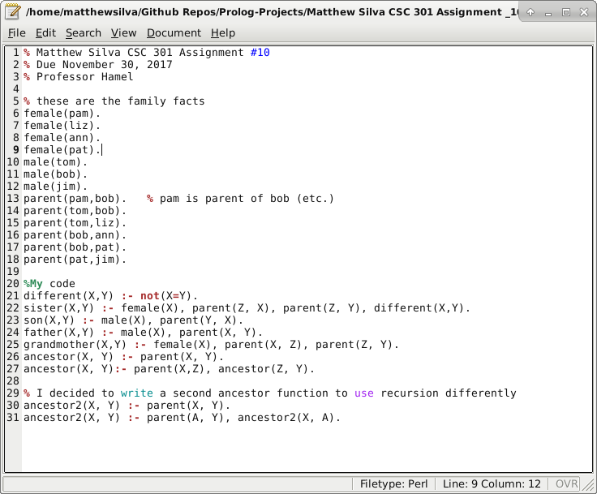
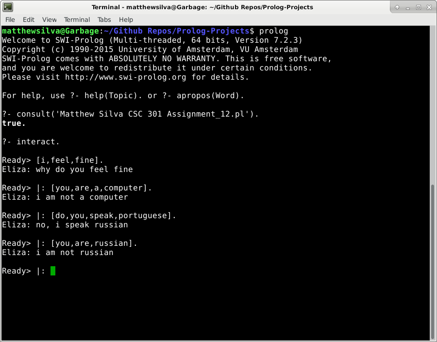

# Prolog-Projects

The above is an implementation of an ancestry analyzer in Prolog.

It uses a list of facts that detail the family relations among a group of people to
infer more relations between the people in that group.

e.g.

If Elizabeth is female and is Sam's parent, then and Elizabeth is Sam's mother.
If Sam is also Laura's parent, then Elizabeth is Laura's grandmother  

Prolog's logical programming paradigm makes it perfect for inference programming like this
that requires applying a set of rules to a dataset.

Dependencies/Installation:

	Install the Prolog implementation of your choice (swi installation shown below)

	sudo apt-get install swi-prolog
	
	
Running Code in Interpreter:

Start the Interpreter:
	
	prolog
	
	
	
Load the Code:
	
	consult('<filename>').
	
	e.g.
	
	consult('Matthew Silva CSC 301 Assignment_12.pl').
	
	
Run the Code:
	
See the corresponding PDF for examples
	

	
	The screenshot above shows an example of the interactive Eliza chat bot from Assignment_12.
	